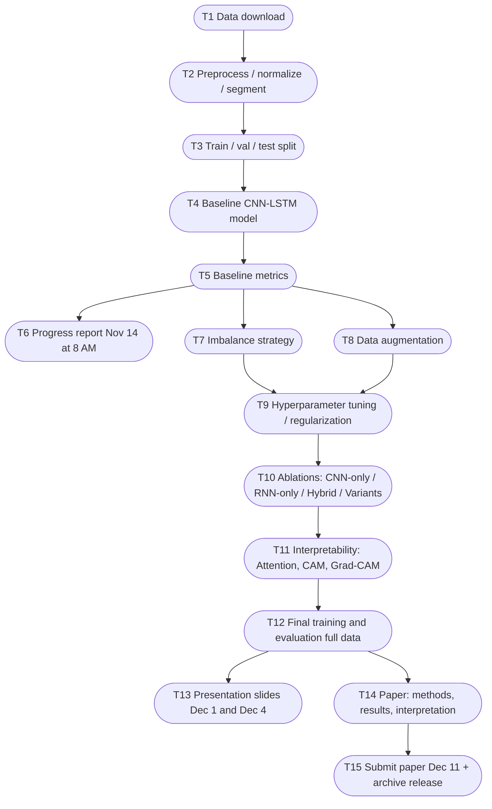

# Deep Learning for ECG Arrhythmia Classification
**CS/DS 541 – Fall 2025**  
**Team:** Ananya Shukla, Tom Arnold, Nate Hindman  

---

## Project Overview
This project implements a hybrid CNN–RNN model for ECG arrhythmia classification using the **PhysioNet 2017** dataset.  
Deliverables include an **Intermediate Progress Report (Nov 14 @ 8:00 AM)**, **Presentation (Dec 1)**, and **Final Paper (Dec 11)**.

---

## Quick Visual: Dependency Map (Mermaid)


---

## Tasks (Single-line, with dependencies)
- [ ] **[T1]** Download PhysioNet 2017 dataset and stage backup MIT-BIH (no deps)
- [ ] **[T2]** Implement preprocessing (bandpass, z-score), segmentation scripts **(dep: T1)**
- [ ] **[T3]** Produce train/val/test split with class stats **(dep: T2)**
- [ ] **[T4]** Implement baseline serial CNN->LSTM model in PyTorch **(dep: T3)**
- [ ] **[T5]** Run quick baseline training; compute F1/AUROC/sensitivity/specificity **(dep: T4)**
- [ ] **[T6]** Draft and submit Intermediate Progress Report (summary of setup/baseline) **(dep: T5) — due Nov 14 @ 8:00 AM**

- [x] **[T6.1]** BUGFIX data leakage (recordings split properly) **(prof)**
- [x] **[T6.2]** Add training accuracy/loss logging **(prof)**
- [ ] **[T6.3]** Verify label assignment per segment **(prof)**

- [ ] **[T7]** Choose and implement primary class-imbalance strategy (weighted loss / sampler / focal) **(dep: T5)**
- [ ] **[T8]** Implement ECG data augmentation (jitter, scaling, time-warp, cutout) **(dep: T5)**
- [x] **[T9]** Add regularization (BN/Dropout) and run hyperparameter search **(dep: T7, T8)** 

- [ ] **[T10]** Run ablations (CNN-only, RNN-only, hybrid; GRU/LSTM/Transformer variant) **(dep: T9)**
  - *CNN-LSTM Debugging:* CNN-LSTM fails (F1=0.14, AUROC=0.50) vs CNN-only (F1=0.61, AUROC=0.73)
  - *Note: CNN-only (F1=0.61, AUROC=0.73) only with overlapping segments, removed for leakage, AUROC drops.*
  - **Data & Training Issues (Priority 1)**
  - [x] **[T10.0]** Test 20s segments -> Both models worse; segment length not the issue
  - [x] **[T10.4]** Test differential learning rates (CNN=1e-4, LSTM=1e-3)
  - **Architecture Variants (Priority 2)**
  - [ ] **[T10.5]** Test bidirectional LSTM **(prof)** -> `model_bilstm.py`
  - [ ] **[T10.6]** Test transfer learning (pretrain CNN, freeze, train LSTM) **(prof)**
  - [x] **[T10.7]** Test average LSTM outputs (not just h_n[-1])
  - [ ] **[T10.8]** Test reduced LSTM complexity (1 layer, 64 units) -> `model_simple_lstm.py`
  - [ ] **[T10.9]** Test LSTM-only model (diagnostic) -> `model_lstm_only.py`
  - [ ] **[T10.10]** Test residual connections around LSTM -> `model_residual.py`
  - [ ] **[T10.11]** Test GRU instead of LSTM -> `model_gru.py`
  - [ ] **[T10.12]** Test attention mechanism -> `model_attention.py`

- [ ] **[T11]** Implement interpretability (attention viz, CAM/Grad-CAM) and analyze cases **(dep: T10)**

- [ ] **[T12]** Train final model on full data; cross-val; finalize metrics/tables **(dep: T11)**
- [ ] **[T13]** Build and rehearse presentation; insert figures/results **(dep: T12) — Dec 1 & Dec 4**
- [ ] **[T14]** Write paper (methods, results, interpretability, limits); finalize figures **(dep: T12)**
- [ ] **[T15]** Submit final paper **(Dec 11)**; tag GitHub release with code, configs, checkpoints **(dep: T14)**

---

## Timeline by Calendar Week (starts Nov 9)

### Week of **Nov 9–Nov 15** (includes Nov 14 due)
- [x] [T1] Data download
- [x] [T2] Preprocessing/segmentation
- [x] [T3] Train/val/test split + class stats
- [x] [T4] Baseline CNN->LSTM implementation
- [x] [T5] Baseline training + metrics
- [x] [T6] **Submit Intermediate Progress Report (Nov 14 @ 8:00 AM)**

### Week of **Nov 16–Nov 22**
- [x] [T7] Class-imbalance strategy (weighted loss/sampler/focal)
- [ ] [T8] Data augmentation for ECG
- [x] [T9] Regularization + hyperparameter tuning (lr, batch, hidden units)

### Week of **Nov 23–Nov 29**
- [x] [T10] Ablations (architecture variants)
- [ ] [T11] Interpretability (attention, CAM/Grad-CAM) and analysis notes

### Week of **Nov 30–Dec 6**
- [ ] [T13] Presentation slides + practice (**Dec 1**)
- [ ] [T12] Final training on full data; cross-val; finalize tables


### Week of **Dec 7–Dec 11**
- [ ] [T14] Paper write-up (methods, results, interpretation, limitations, references)
- [ ] [T15] **Submit final paper (Dec 11)** and archive release (code + models)

---

## Notes
- Keep tasks one-line and update status in place; dependencies are indicated via **(dep: …)** and the ID map above.
- If a dependency changes, update the **Dependency Map** and the **(dep: …)** tags; no special tooling required.
- Each task is discrete and can be updated directly in GitHub via checkboxes.
-	After Dec 11, optional extensions include multi-lead ECGs, real-time inference, and transformer-based temporal modules.

---

# ECG Arrhythmia Classification

## Setup
```bash
pip install -r requirements.txt
```

## Usage

### 1. Preprocess Data
```bash
python preprocessing.py      # Download and preprocess
python create_splits.py      # Create train/val/test splits
```

### Notes
- Bandpass filter: 0.5-40 Hz
- Recording tracking: Each segment linked to parent recording (prevents data leakage)
- Splits: 70% train, 15% val, 15% test (stratified at recording level)
- Class weights: Use with `nn.CrossEntropyLoss(weight=weights)`


### 2. Train Model
```bash
# Train with defaults
python train.py --model cnn_lstm_fixed --seed 42

# Train with custom hyperparameters
python train.py --model cnn_only \
                --seed 42 \
                --lr 1e-3 \
                --weight_decay 1e-5 \
                --batch_size 128 \
                --num_epochs 100 \
                --patience 15
```

### Available Models

#### CNN baseline
python train.py --model cnn_only --seed 42

#### CNN + LSTM (serial architecture)
python train.py --model cnn_lstm --seed 42

#### CNN + Bidirectional LSTM
python train.py --model bilstm --seed 42

#### CNN + Simplified LSTM
python train.py --model simple_lstm --seed 42

#### LSTM only (diagnostic)
python train.py --model lstm_only --seed 42

#### CNN + LSTM with residual connections
python train.py --model residual --seed 42

#### CNN + GRU
python train.py --model gru --seed 42

#### CNN + LSTM with attention
python train.py --model attention --seed 42


### 3. Search & Compare Runs
```bash
# List all training runs
python search_runs.py --list

# Find best run by F1 score
python search_runs.py --best f1

# Find best by AUROC
python search_runs.py --best auroc

# Search by model type
python search_runs.py --model cnn_lstm

# Search by learning rate range
python search_runs.py --lr-min 1e-5 --lr-max 1e-3

# Compare specific runs
python search_runs.py --compare run1 run2
```


### 4. Visualize Training
```bash
# Plot single run
python plot_training.py checkpoints/cnn_only_seed42_TIMESTAMP_history.json

# Compare multiple models
python plot_training.py \
    checkpoints/cnn_only_seed42_*_history.json \
    checkpoints/cnn_lstm_seed42_*_history.json \
    --labels "CNN-only" "CNN-LSTM" \
    --compare --save figures/

# Show summary statistics
python plot_training.py checkpoints/*_history.json --summary
```


### 5. Test Components
```bash
python dataset.py            # Test DataLoader
python model.py              # Test model architecture
```


## Model Architecture

### CNN-LSTM (Baseline)
Serial CNN→LSTM:
- CNN: 3 conv blocks (32 -> 64 -> 128 channels)
- LSTM: 2 layers, 128 hidden units
- Output: 4 classes (Normal, AF, Other, Noisy)

### Metrics
- F1 score (weighted)
- AUROC (one-vs-rest)
- Accuracy
- Sensitivity per class
- Specificity per class


## Files

### Core Pipeline
- `preprocessing.py` - Download and preprocess ECG data (w/ recording tracking)
- `create_splits.py` - Create stratified recording-level splits (no leakage)
- `dataset.py` - PyTorch Dataset and DataLoader
- `train.py` - Training loop w/ comprehensive logging

### Models
- `model.py` - CNN-LSTM architecture
- `model_cnn_only.py` - CNN baseline
- `model_bilstm.py` - Bidirectional LSTM
- `model_simple_lstm.py` - Simplified LSTM
- `model_lstm_only.py` - LSTM only
- `model_residual.py` - Residual connections
- `model_gru.py` - GRU variant
- `model_attention.py` - Attention mechanism

### Utilities
- `plot_training.py` - Visualize training curves
- `search_runs.py` - Search and compare experiments
- `visualize.py` - Visualize preprocessing steps


## Output Structure

### Preprocessed Data
```
data/
├── processed/
│   ├── X.npy                    # All segments (num_segments, 1500)
│   ├── y.npy                    # All labels
│   └── recording_ids.npy        # Recording ID for each segment (prevents leakage)
└── splits/
    ├── X_train.npy, X_val.npy, X_test.npy
    ├── y_train.npy, y_val.npy, y_test.npy
    └── class_weights.npy
```

### Training Outputs (Timestamped & Logged)
```
checkpoints/
├── {model}_{seed}_{timestamp}.pt              # Model weights
├── {model}_{seed}_{timestamp}_history.json    # Training curves (all epochs)
└── {model}_{seed}_{timestamp}_results.json    # Final results + complete config

Example:
├── cnn_lstm_seed42_20251128_153045.pt
├── cnn_lstm_seed42_20251128_153045_history.json
└── cnn_lstm_seed42_20251128_153045_results.json
```

### Figures
```
figures/
├── {model}_curves.png           # Individual training curves
└── model_comparison.png         # Side-by-side comparison
```


## Training Log Contents

Each training run automatically logs:

### Config (All Hyperparameters)
- Model: name, file, class, parameters
- Data: split_dir, batch_size
- Training: epochs, patience, seed
- Optimizer: type, LR, weight_decay
- Scheduler: type, mode, factor, patience
- Regularization: gradient_clip_norm
- Loss: criterion, class_weights

### Per-Epoch Metrics
- Train: loss, accuracy
- Val: loss, accuracy, F1, AUROC, sensitivity, specificity
- Learning rate

### Metadata
- Start/end timestamps
- Best epoch, best F1
- Early stopping flag


## Workflow
```bash
# 1. Preprocess (with recording tracking)
python preprocessing.py
python create_splits.py

# 2. Train baseline models
python train.py --model cnn_only --seed 42
python train.py --model cnn_lstm --lr 1e-4 --lstm_lr 1e-5 --seed 42

# 3. Hyperparameter search
python train.py --model cnn_only --lr 1e-3 --seed 42
python train.py --model cnn_only --lr 5e-4 --seed 42
python train.py --model cnn_only --lr 1e-5 --seed 42

# 4. Find best configuration
python search_runs.py --model cnn_only --best f1

# 5. Visualize comparison
python plot_training.py checkpoints/cnn_only_*_history.json --compare --save figures/

# 6. Test multiple seeds for best config
for seed in 42 123 456; do
    python train.py --model cnn_only --lr 5e-4 --seed $seed
done

# 7. Compare stability
python search_runs.py --model cnn_only --lr-min 5e-4 --lr-max 5e-4
```

